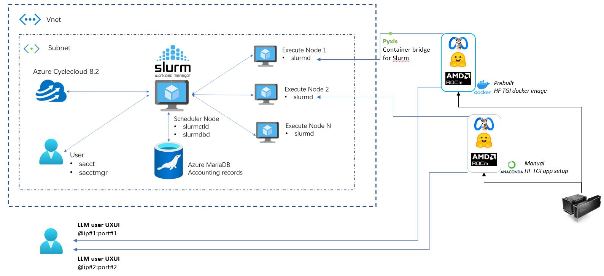
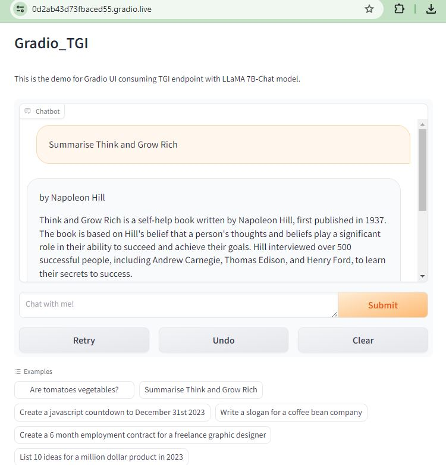

# LLM Inference example on Azure using CycleCloud + Slurm

This repo shows how to setup LLM inference example workload on Azure's CycleCloud + Slurm. This repo assumes that you already setup CycleCloud cluster with Slurm and this repo shows how to build a LLM inference workload on top of the Slurm compute node (worker node). I used Text Generation Inference (TGI) (https://github.com/huggingface/text-generation-inference) from HuggingFace as an LLM inference example. As this example is NOT VERIFIED on CycleCloud instance, you might need to manually modify some codes in tgi_conda_setup.sh.

<a ></a>

The image is modified from (https://techcommunity.microsoft.com/t5/azure-high-performance-computing/enabling-job-accounting-for-slurm-with-azure-cyclecloud-8-2-and/ba-p/3413803)

## Prerequisites

To setup CycleCLoud + Slurm, refer to the official Azure's documentation and tutorials. 

## LLM Inference deployment on the Slurm compute node

### Option A: use Nvidia's Pyxis plug-in to use LLM docker image. 

After installation of Pyxis (https://github.com/NVIDIA/pyxis), launch a prebuilt ROCm-enabled TGI LLM Inference from HuggingFace. 

```bash
srun --container-image=ghcr.io/huggingface/text-generation-inference:1.4-rocm
```

### Option B: manual installation of LLM image on CycleCloud compute node.

```bash
bash tgi_conda_setup.sh
```

## LLM Inference uxui lanuch

Once LLM Inference launched on the Slurm compute node, you can launch an additional uxui application so that users can access to the LLM instance. This demo is from (https://huggingface.co/docs/text-generation-inference/basic_tutorials/consuming_tgi#gradio)

```bash
python tgi_uxui.py
```

<a ></a>
